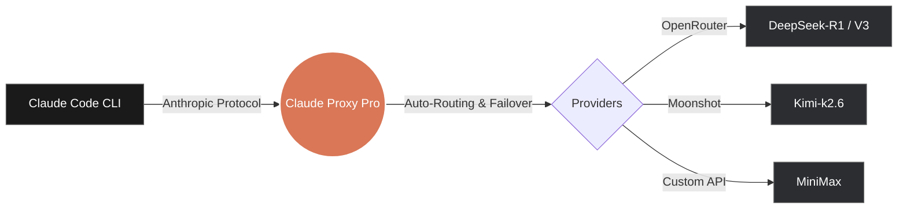

# 🦀 Claude Proxy Pro


> **"You won't have to sell your kidney to use Claude Code anymore! hahaha"** 💸

**Claude Proxy Pro** is an ultra-lightweight, blazing-fast, and standalone native desktop GUI application built entirely in **Go** and **Wails**. It serves as an invisible, highly intelligent bridge between Anthropic's amazing [Claude Code](https://github.com/anthropics/claude-code) CLI and **ANY** LLM provider of your choice.

## 🥊 The Ultimate Comparison: Why We Destroy The Competition

If you've looked at other projects like `free-claude-code`, you've seen the painful reality of traditional wrappers. They require you to install Python, manage dependencies, spin up heavy background server processes in your terminal, and constantly check if the connection dropped. 

**We put an end to that.**

You won't need to search YouTube for how to run Claude for free with every provider you want to try, and you won't need to enter the terminal and run complex code. Focus on your work, and with our app, **with one click you can change any model from any provider at any time, even in the middle of a session!** No limits for you now. If a provider goes down, switch from the app and Claude will continue with you seamlessly.

| Feature | Claude Proxy Pro 🦀 | Free Claude Code (Py/Node) |
|---------|---------------------|---------------------------|
| **Core Engine** | Pure Go (Compiled Native App) | Python / Node.js Scripts |
| **App Size** | **~9.7 MB** Binary 🔥 | Huge Python/Node Runtimes |
| **RAM Usage** | **~88 MB** | 150 MB - 300 MB+ |
| **Installation** | Run directly from source / `.app` | Needs `pip`, `uv`, or `npm` |
| **Background Processes** | **None.** Pin to Dock and forget. | Requires running terminal servers (`fcc-server`) |
| **User Interface**| Sleek Native Glassmorphism GUI | Terminal only + clunky local web admin |
| **Claude Sync** | **100% Automatic** (`settings.json`) | Manual environment variables or scripts |

**Our app is smaller than a wallpaper or a short video.** Just 9.7MB of pure native power. No heavy background servers, no hidden terminal processes that disconnect without you noticing. Everything is right in front of your eyes.

### ⚡ Architecture Flow



### 🧠 The Magic Under the Hood: Auto-JSON Injection
When you click **"Activate"** on any model in our sleek UI, Claude Proxy Pro's internal engine instantly parses your system's `settings.json`, injects the exact custom aliases, safely writes it back to disk at lightning speed, and updates the active endpoint. 

**Before (Boring Claude Code):**
```json
{
  "customModels": {}
}
```

**After (Claude Proxy Pro Magic):**
```json
{
  "customModels": {
    "claude-3-7-sonnet-20250219": "DeepSeek-R1",
    "claude-3-5-sonnet-20241022": "DeepSeek-R1",
    "claude-3-opus-20240229": "DeepSeek-R1",
    "claude-3-5-haiku-20241022": "DeepSeek-R1"
  }
}
```

You never have to touch a JSON file again. You click a button, and the proxy handles the dark magic.

## 🛠 Local Build Instructions (The Hacker Way)

Since the code is 100% open source, you don't have to rely on our pre-built binaries or deal with macOS Gatekeeper "Quarantine" warnings. You can compile it locally on your machine in seconds!

Build it once, **pin it to your Dock**, and you have it forever as a permanent desktop app!

### Requirements
- [Go 1.23+](https://go.dev/dl/) installed.
- [Wails v2](https://wails.io/docs/gettingstarted/installation) installed (`go install github.com/wailsapp/wails/v2/cmd/wails@latest`).

### 3 Simple Terminal Commands:
```bash
# 1. Clone the repository
git clone https://github.com/Xoner1/claude-proxy-pro.git
cd claude-proxy-pro

# 2. Build the app locally
wails build -clean

# 3. Open your brand new Native App!
# (macOS)
open build/bin/claude-proxy-pro.app
# (Windows)
start build/bin/claude-proxy-pro.exe
# (Linux)
./build/bin/claude-proxy-pro
```

That's it! Drag `claude-proxy-pro.app` to your Applications folder, pin it to your Dock, and enjoy the most powerful AI coding setup on the planet!

## 🎮 How to use
1. Open **Claude Proxy Pro**.
2. Go to the **Providers** tab and add your favorite provider (e.g., OpenRouter) and your API Key.
3. Click **Sync Models** on the Models tab.
4. Pick the model you want (like `DeepSeek-R1`) and hit **Activate**.
5. Open your terminal and run `claude`. That's it!

---
*Built with ❤️ (and a lot of coconut juice) for the open-source community.*
